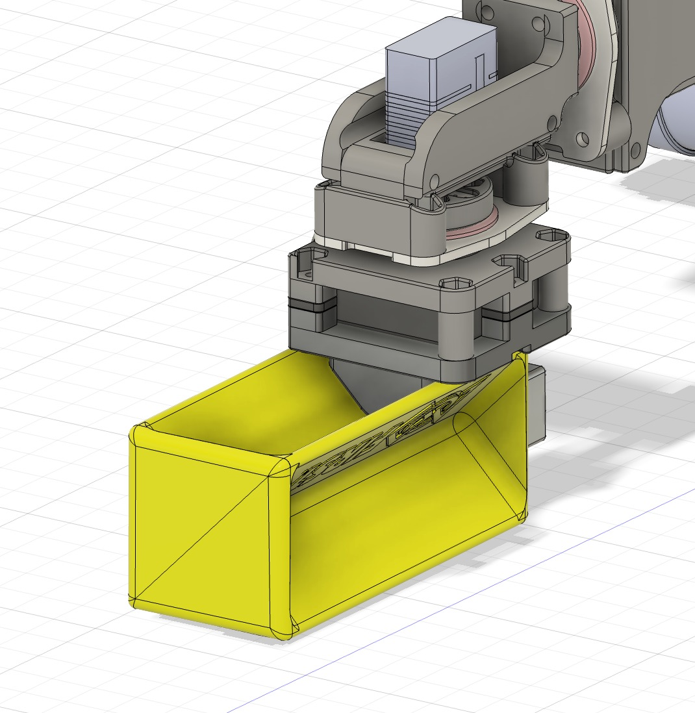
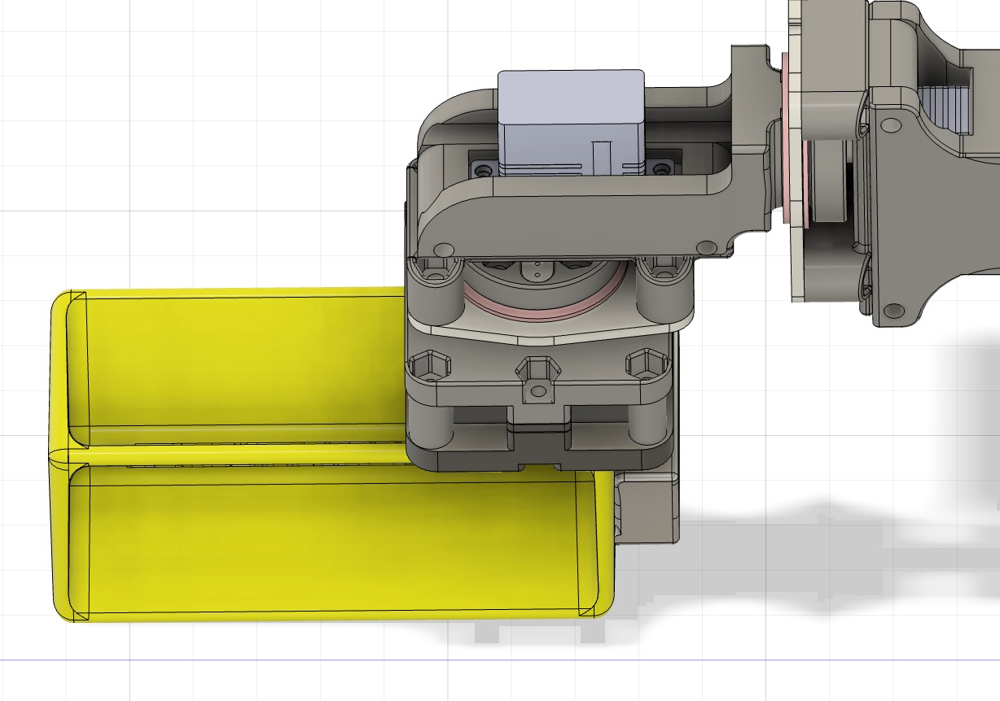
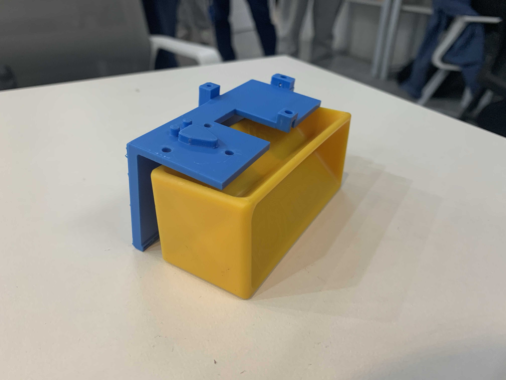
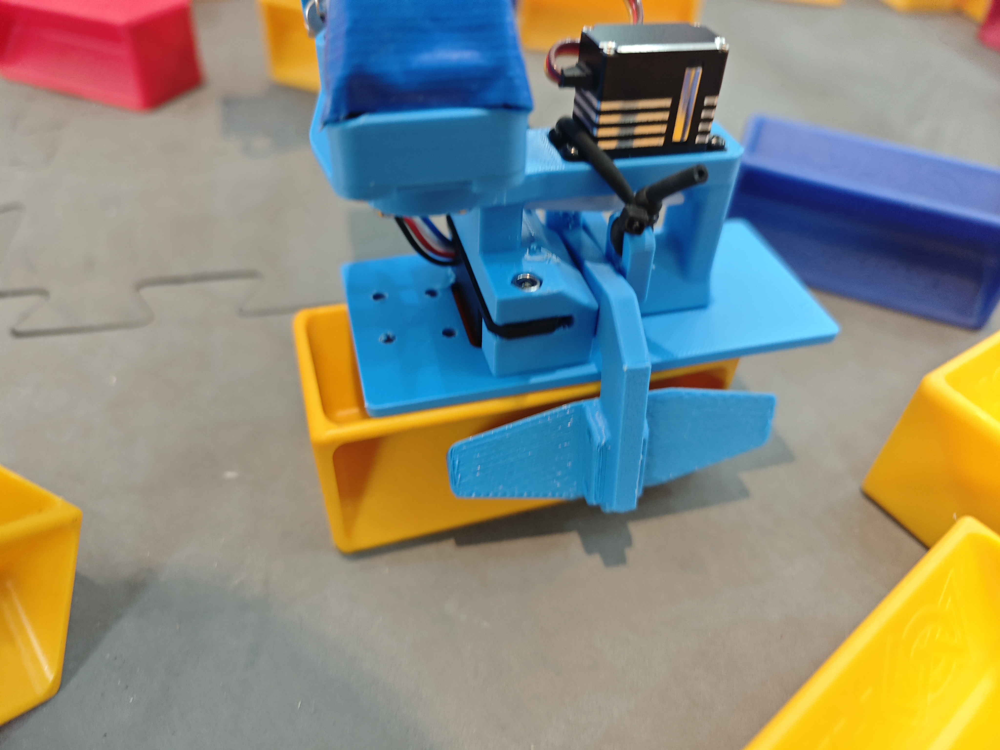
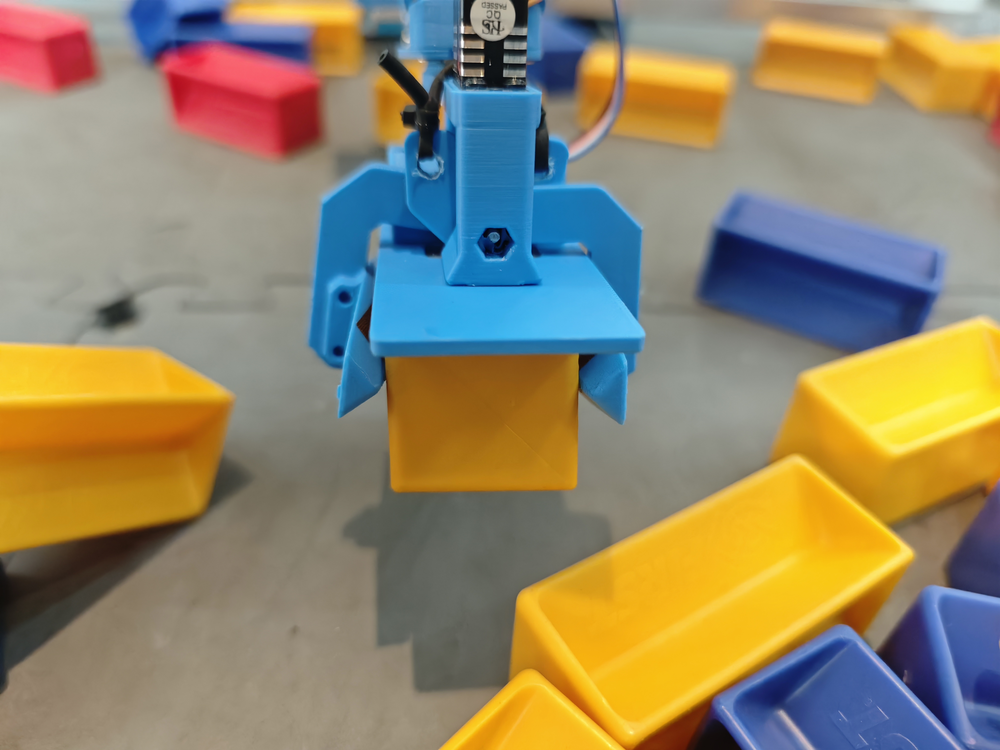
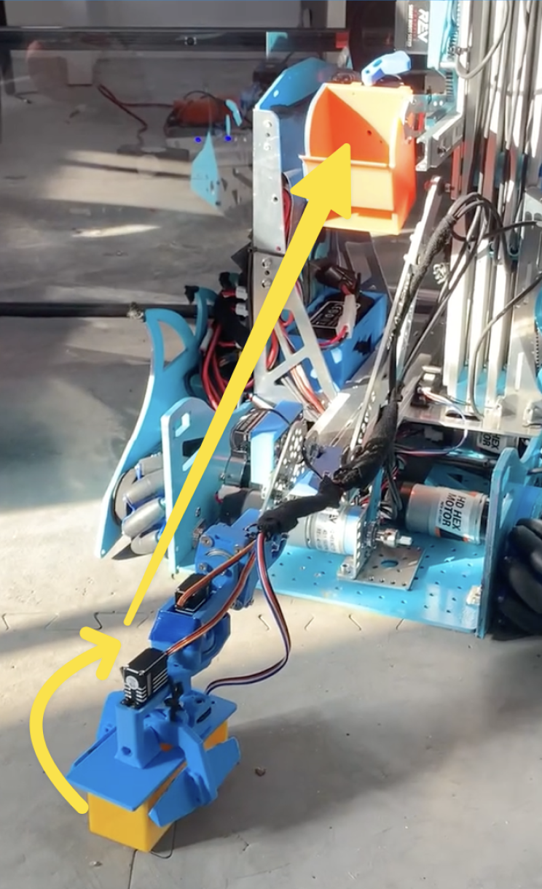
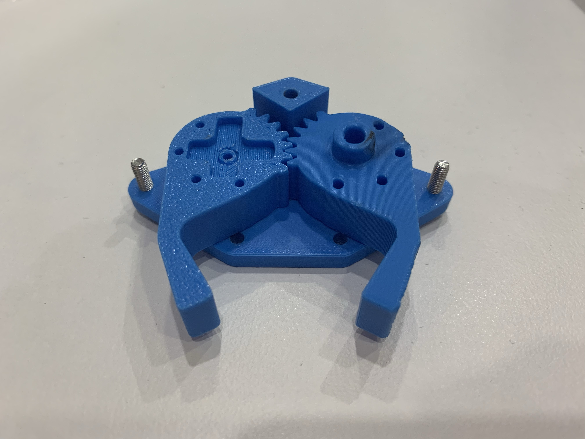
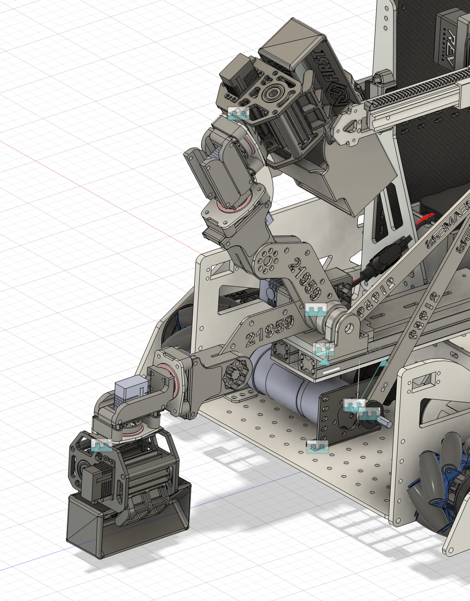
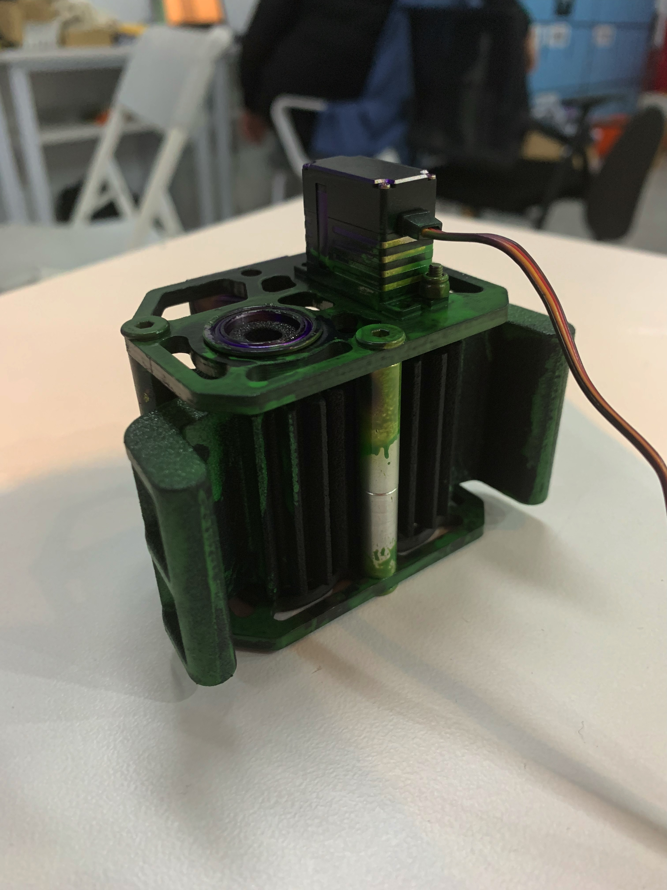

# 爪子设计迭代  

为了提升机器人在比赛中的抓取性能，我们对爪子设计进行了多次迭代。从初期的简单设计到后期的精密结构，每一代方案都针对前一代的不足进行了优化，不断提高夹持的稳定性、精准性和操作便捷性。以下是每一代设计的详细介绍：  

## **第一代**  

第一代设计通过一个三角形结构卡入样品的凹槽，再由一个橡胶包裹的“L”形臂进行辅助夹持。虽然设计实现了基本的夹持功能，但操作较为繁琐，且夹持效果不够稳固，难以满足实际需求。  

  
  

---

## **第二代**  

第二代设计采用了一个拉长的“L”形结构与一个钩子相结合。“L”形结构作为铲子滑入样品底部，钩子则卡入样品凹槽完成固定。相比第一代设计，精准度有所提升，但操作仍然不够便捷，夹持稳定性也未达到理想效果。由于这些问题，该设计未在 Fusion 中进行建模，仅停留在原型阶段，未进入实际制作环节。  

  

[视频演示](https://21959.com.cn/demo/v2.mp4)  

---

## **第三代**  

第三代设计采用两个包裹橡胶的长方形结构，通过卡入样品凹槽实现夹持。该设计效果相比前两代已有显著提升，但对样品对准要求较高。如果样品未能精准对齐，夹持操作会变得困难。由于这一限制，该设计的图纸未被保留，团队直接进入了第四代设计阶段。  

  
  
  
[视频演示](https://21959.com.cn/demo/v3.mp4)  

---

## **第四代**  

第四代设计采用了齿轮传动结构，使两侧爪子能够同步运动，从而精准卡入样品的凹槽进行夹持。该设计进一步提升了操作的协调性与稳定性，但仍需要更多实际测试来验证效果并优化细节。  

  

---

## **第五代**  

第五代设计是在与多支队伍交流学习后优化得出的方案。外部结构包覆了碳纤维材料，显著提升了强度与耐用性。该设计在夹持效果上更加紧固可靠，同时抓取样品时的精准度和稳定性达到了全新高度。这一方案成为目前最成熟的设计。  

  
  

---  

通过不断迭代与优化，我们的爪子设计不仅实现了功能性提升，还展现了团队在工程设计中的创新与进步。